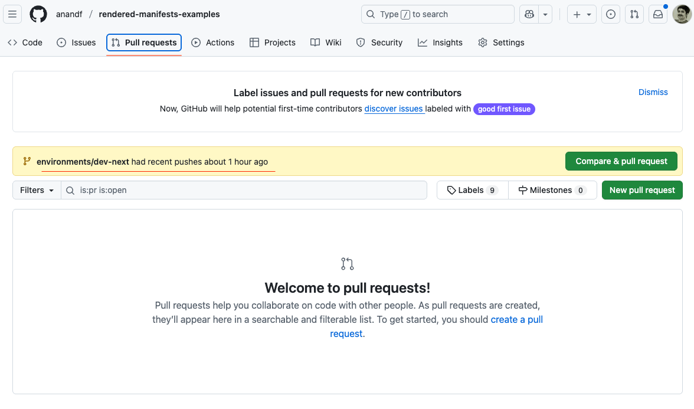
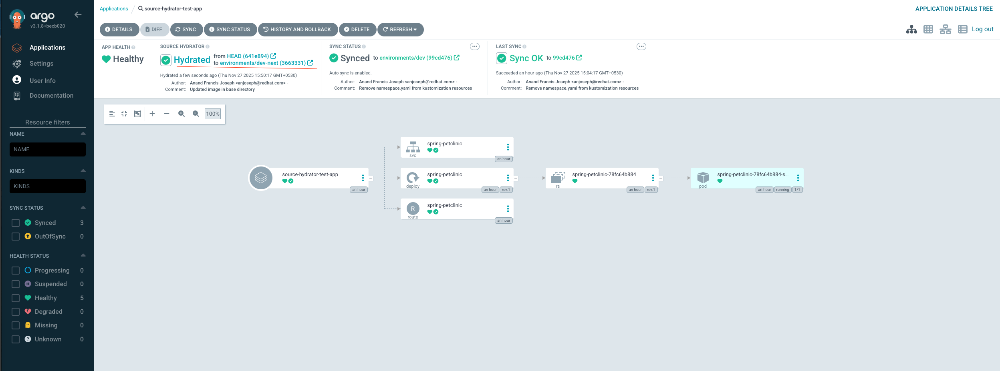
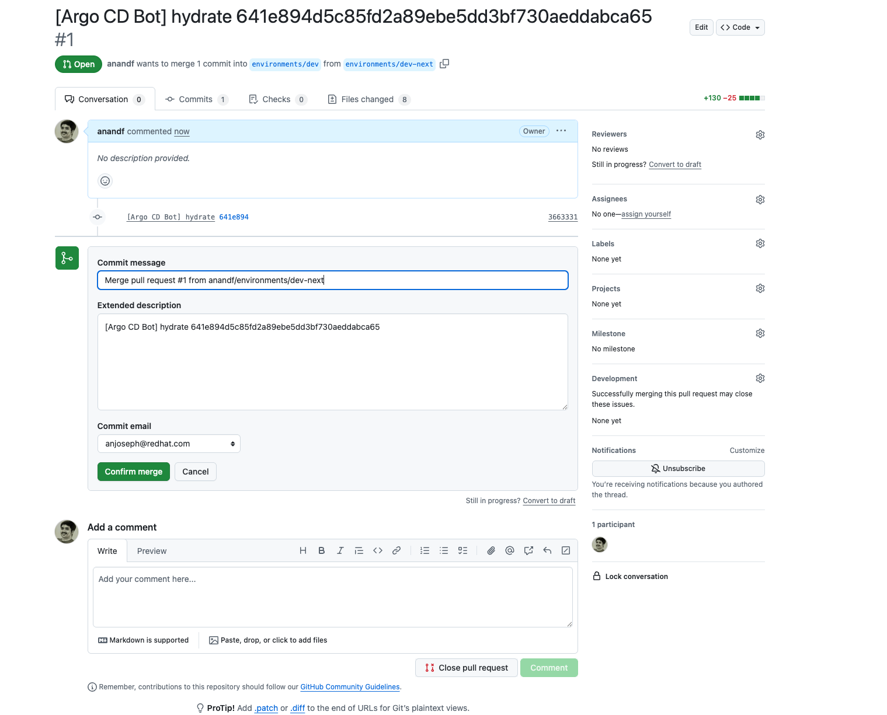
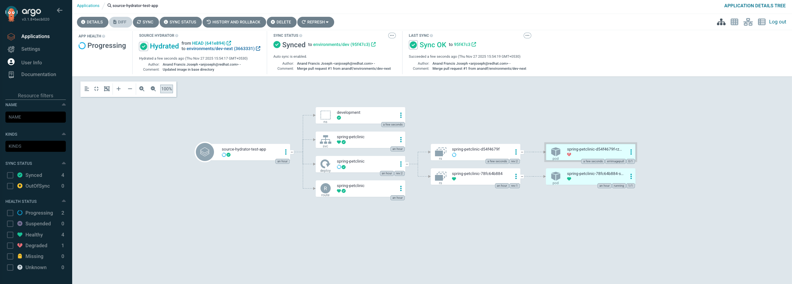

## Introduction
This document describes the steps required to enable the Source Hydrator feature in OpenShift GitOps v1.16.0 or later.

## Prerequisites
- OpenShift Cluster with v4.16 or later
- The OpenShift CLI binary (oc) is installed and available in your system's PATH.
- gomplate binary is installed and available in your system's PATH. If not it can be installed via the below options

    Option 1: Using brew install on MacOS and Linux
    ```shell
    brew install gomplate
    ```
    Option 2: Using Go install  (all OS)
    ```shell
    go install github.com/hairyhenderson/gomplate/v4/cmd/gomplate@latest
    export PATH=$PATH:$GOPATH/bin
    ```
    Option 3: Using docker/podman for running without any local installation
    ```shell
    alias gomplate="$DOCKER run hairyhenderson/gomplate:stable"
    gomplate help
    ```
## Installation of OpenShift GitOps

### Create the namespace

```shell
oc create namespace openshift-gitops-operator
```

### Create the OperatorGroup

```shell
oc create -f - <<EOF
apiVersion: operators.coreos.com/v1
kind: OperatorGroup
metadata:
  name: openshift-gitops-og
  namespace: openshift-gitops-operator
spec:
  upgradeStrategy: Default
EOF
```

### Create the Subscription

```shell
oc create -f - <<EOF
apiVersion: operators.coreos.com/v1alpha1
kind: Subscription
metadata:
  labels:
    operators.coreos.com/openshift-gitops-operator.openshift-gitops-operator: ""
  name: openshift-gitops-operator
  namespace: openshift-gitops-operator
spec:
  channel: latest
  installPlanApproval: Automatic
  name: openshift-gitops-operator
  source: redhat-operators
  sourceNamespace: openshift-marketplace
  startingCSV: openshift-gitops-operator.v1.18.1
EOF
```
### Wait for the installation to complete

```shell
oc wait subscription openshift-gitops-operator -n openshift-gitops-operator \
  --for=jsonpath='{.status.installedCSV}' \
  --timeout=3m
```
### Wait for the operator deployment to be ready
```shell
until oc get deploy/openshift-gitops-operator-controller-manager -n openshift-gitops-operator &> /dev/null; do \
  sleep 10; \
done && \
oc rollout status deploy/openshift-gitops-operator-controller-manager -n openshift-gitops-operator -w
```

### Wait for the ArgoCD instance to be available
```shell
oc wait argocd/openshift-gitops -n openshift-gitops \
  --for=jsonpath='{.status.phase}'=Available \
  --timeout=3m
```

## Enable the source hydrator feature

```shell
oc patch argocd openshift-gitops -n openshift-gitops  -p '{"spec": {"controller": {"extraCommandArgs": ["--hydrator-enabled", "--commit-server", "openshift-gitops-commit-server.openshift-gitops.svc.cluster.local:8086"]}}}' --type merge
```

```shell
oc patch argocd openshift-gitops -n openshift-gitops  -p '{"spec": {"server": {"extraCommandArgs": ["--hydrator-enabled"]}}}' --type merge
```

## Install the Source Hydrator (commit-server)

```shell
gomplate -f ${PWD}/hydrator-install/kustomization.yaml.tmpl -o ${PWD}/hydrator-install/kustomization.yaml --datasource argocd=${PWD}/hydrator-install/argocd.yaml && oc create -k ${PWD}/hydrator-install -n openshift-gitops
```

**Note:** If you need to use a different Argo CD version or Argo CD instance, override the values in `values.yaml` before running the above command.

## Create secrets containing the credentials required to connect to git repository for push/pull operations

There are 3 options to create credentials for the push/pull operation and the user can choose from one of the three options whichever suits them better.
1. Github App
2. HTTPS credentials
3. SSH credentials

### Option 1: Github App

#### Create a Github App

Refer the below github document to create a Github App
https://docs.github.com/en/apps/creating-github-apps/registering-a-github-app/registering-a-github-app

#### Update the data file

Edit the Github App related metadata and URL in the data file `${PWD}/auth/data/config.yaml`

#### Create the push and pull secret
```
gomplate -f ${PWD}/auth/templates/github-app.yaml.tmpl -o ${PWD}/auth/github-app.yaml --datasource config=${PWD}/auth/data/config.yaml && oc apply -f  ${PWD}/auth/github-app.yaml -n openshift-gitops
```

### Option 2: HTTPS Credentials

#### Create a fine grained Personal Access Token (PAT)
Refer the below github document to create a fine grained PAT https://docs.github.com/en/authentication/keeping-your-account-and-data-secure/managing-your-personal-access-tokens#creating-a-fine-grained-personal-access-token

When creating the PAT, give the following permissions:  
- Read access to commit statuses and metadata
- Read and Write access to code, merge queues, and pull requests

#### Update the data file

Edit the username/password and URL in the data file `${PWD}/auth/data/config.yaml`

#### Create the push and pull secret
```
gomplate -f ${PWD}/auth/templates/git-https.yaml.tmpl -o ${PWD}/auth/git-https.yaml --datasource config=${PWD}/auth/data/config.yaml && oc apply -f  ${PWD}/auth/git-https.yaml -n openshift-gitops
```

### Option 3: SSH Credentials

#### Create a SSH key using the following command
```shell
ssh-keygen -t rsa -b 4096 -C "your_email@example.com" -f $HOME/.ssh/my-private-key
```
Refer the github documentation for more details https://docs.github.com/en/authentication/connecting-to-github-with-ssh/generating-a-new-ssh-key-and-adding-it-to-the-ssh-agent

#### Share the generated key

Refer the github documentation for details https://docs.github.com/en/authentication/connecting-to-github-with-ssh/adding-a-new-ssh-key-to-your-github-account

#### Update the data file

Edit the privateKeyPath and URL in the data file `${PWD}/auth/data/config.yaml`

#### Create the push and pull secret
```
gomplate -f ${PWD}/auth/templates/git-ssh.yaml.tmpl -o ${PWD}/auth/git-ssh.yaml --datasource config=${PWD}/auth/data/config.yaml && oc apply -f  ${PWD}/auth/git-ssh.yaml -n openshift-gitops
```

## Prepare the Destination Namespace

```shell
oc create namespace petclinic-dev
oc label namespace petclinic-dev argocd.argoproj.io/managed-by=openshift-gitops
```

## Create the Application in Argo CD

```shell
oc create -f - <<EOF
apiVersion: argoproj.io/v1alpha1
kind: Application
metadata:
  name: source-hydrator-test-app
  namespace: openshift-gitops
  labels:
    app: springboot-petclinic
    environment: development
spec:
  project: default
  destination:
    server: https://kubernetes.default.svc
    namespace: petclinic-dev
  syncPolicy:
    automated:
      enabled: true
      selfHeal: true
    syncOptions:
      - CreateNamespace=true
  sourceHydrator:
    drySource:
      repoURL: https://github.com/anandf/rendered-manifests-examples
      path: springboot-petclinic/development
      targetRevision: HEAD
    hydrateTo:
      targetBranch: environments/dev-next
    syncSource:
      targetBranch: environments/dev
      path: springboot-petclinic/development
EOF
```
## Confirm the Hydration
Verify that the Argo CD created a new branch dry changes are pushed



## Create a Pull request in the repository to the target env branch

## Merge the pull request to promote the dry changes to the dev environment


## Once merged, new changes will be deployed to the new environment
